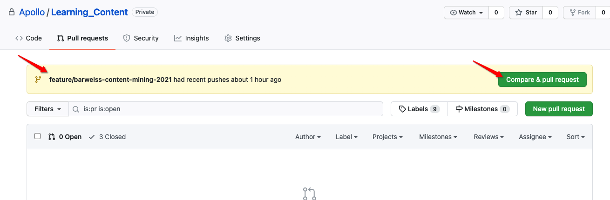

## 📔 Learning Content

This repository is to store all files related to Learning content. This is where we house, maintain, and collaborate on the Apollo learning courses. In this README file we will explain how the Learning_Content repository is orgainized and some of the standards that are in place to keep this repository clean and organized.

## ℹ️  Definitions

- **Learning Path** - a learning path is a collection of modules
- **Module** - a basic consumble unit of foundational, technical, or advance implentation/Product learning 
- **Use Case** - a scenario that demonstrates real life implementations, typically utilizes multiple skills
- **Lab** - an interactive activity and typically has hands on action about a topic to re-inforce a particular learning objectives
- **Tags** - a collection of tags describing the course content, leveraged in moment of need and search of a specific topic

## 🔱 The Zen of the Learning Content Repository

1. A single source of truth for all files and media related to a learning path/module, course, etc.
2. Treating Learning Content as code, which allows Cisco to develop and maintain all learning content in an agile/lean work flow. Ensure that updates are done accurately and minimizes team confusion. That course development and maintenance is streamlined and simplified allow Cisco to quickly bring new learning paths/courses to market and update existing courses in a timely manner.
3. To create a process that is straight forward and easy to understand, which makes it easy for vendors and employees to collaborate.
4. To develop accurate and consistent learning journeys.

## 💢 Repository Structure

- `<ROOT FOLDER>` - This is the main repo name, which contains subdirectories (defined below), `Root folder` is the same name as the repo which is labeled after the learning content being created.
- `assessments` - This is where skill assessments/quizzes related to job skills or course specific skills are defined.
- `assets` - Use this subdirectory to house any assets related to content, diagrams, images .. etc
- `course-outline` This subdirectory is used to define the course outline, template included.
- `labs` - This subdirectory where `hands on labs` related to the learning content is defined. This is also treated as a standalone module when building a learning path.
- `learning-path`- This subdirectory contains work related to defining a learning path from the `modules` defined for the course.
- `modules` - This subdirectory contains the `micro learning` portions of the course content, this is derived from the course outline and expanded upon in details.
- `tags` - This is where we will define content related tags in `JSON` format, this will be leveraged when locating and searching for content in `Ti`.
- `use-cases` - This is where related, real world scenarios are defined and built, `Use Cases` are typically used within a learning path or standalone offering outside of the course content.
- `README.md` - This is the main README.md within the repo, this is where the course outline is defined and saved - see a course outline example here.
 
## 〽️  READMEs
In addition to the README you're reading right now, this repo includes other READMEs that describe the purpose of each subdirectory in more detail:

- [assessments/README.md](assessments/README.md)
- [course-outline/README.md](course-outline/README.md)
- [labs/README.md](labs/README.md)
- [learning-path/README.md](learning-path/README.md)
- [modules/README.md](modules/README.md)
- [tags/README.md](tags/reusables/README.md)
- [use-cases/README.md](use-cases/variables/README.md)

## ☑️  Content Definition Workflow 
1. [ ] Define `course outline`, using this [course outline template](/course-outline/outline-template.md)
2. [ ] Define each `module` from course outline and deep dive into module design and topics, leverage [this module template](/modules/module-template.md)
3. [ ] Define related `labs` and real world `use cases`. leverage templates provided here for each [lab](/labs/lab-template.md) or [use case](/use-cases/usecase-template.md) to help you define
4. [ ] Define your learning path using the defined modules, labs and use cases. 

```diff
+ Logically align the path(s) based on Persona and Job skill research work done in parallel to this process
```


## 🚧 Repository Workflow

As we attempt to build a lean-agile workflow for course development, a large part of being able to plan, develop, and maintain the various elements that make up a learning path requires a standardized process that is consistent and efficient. Using a Version Control System (VCS) like Github, enables multiple individuals to work on course content in an efficient manner and provides a platform for easy progress tracking of various parts of a project.

This section assumes that the contributor is familiar with Git and GitOps. There are many tools available to utilize Git(e.g. vscode, git-gui, GitHub Desktop, etc.). Although using Git in the command line is not required, the instructions below will provide Git command lie examples as this is the simplest and most universal method.

This section will evolve as we refine our process. The steps below are provisional and are subject to change.


1. As new work is done a new branch must be created. No direct changes should be done or committed on the `main` branch.

   - The branch should follow the following name conventions:

      `<Vendor Acronym>/<CCO ID or Username>-<brief_description>-<Date of creation using the YYYYMMDD format>`

      Examples:

      `Cisco/toroman-Update_to_Workflow-20211101`
      `NIIT/bob-Intro_to_NA-20211106`

   - To create a new branch is the following command line git commands:

      ```shell
      git checkout -b <NEW BRANCH NAME>
      git push --set-upstream origin <NEW BRANCH NAME>
      ```

2. Once the changes have be made and committed in the local repository push your changes to this remote repository.

      ```shell
      git push
      ```

3. To add your changes to the main branch, you will need to create a pull request. This will be done on the remote GitHub repository. Click this link to take you to the [Cisco-Learning/Network-Automation-Engineer-Core Pull Requests](https://github.com/Cisco-Learning/Network-Automation-Engineer-Core/pulls). If you have already pushed your content to your remote branch you will see a button that says `Compare & pull request` (be sure this is your branch). Click the appropriate button to initiate the pull request, also called a "PR".

    

4. Once the PR has been reviewed, feedback will be presented on the pull request and it will be the requestors responsibility to make the required changes based on this feedback. Once the pull request has been approved, the branch will be `Squashed & Merged`.

## 💡 Resources and Tools
- [Markdown CheatSheet](https://github.com/adam-p/markdown-here/wiki/Markdown-Cheatsheet)
- [Quick Introduction to Git](https://gitimmersion.com/)
- [Markdown Editing with Visual Studio Code](https://code.visualstudio.com/docs/languages/markdown)
