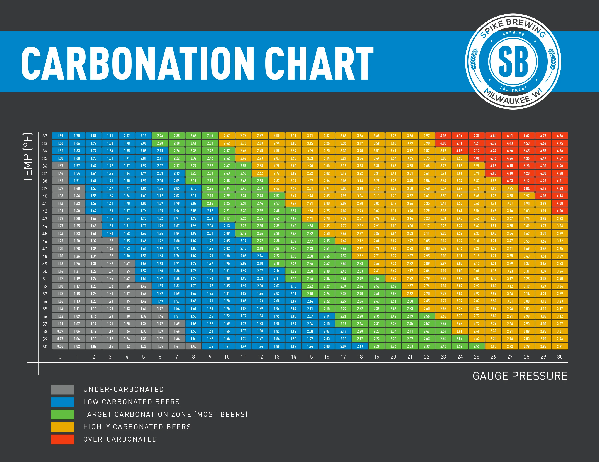

# 🩺 Lab - `Title Here`

## 📖 Lab Scenario

`This lab will walk you through calculating PSI level for ultimate beer carbonation`

## 📐 Skill Level

`Foundational`

## 🧪 Lab Requirements 

`This use case will requires this set of dependencies listed, example below:`

## 🔧 Technical Resources
`Link to any related technical resources available to help build this lab: existing labs, ELT or ILT`

---
